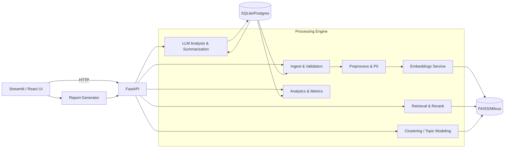

# Service Desk Onboarding Analyzer — Modularization and Vector Intelligence Plan

Overview

- Goal: Evolve the Streamlit monolith into a modular, production-ready system that categorizes issues, detects knowledge gaps, and generates onboarding recommendations.
- Approach: Introduce clear layers (UI, API, Engine, Vector/DB, AI, Services, Config/Prompts) with well-defined contracts, enabling scalability and testability.

Current Monolith Summary

- Entry/UI: Streamlit app with tabs for upload, analysis, visualizations, history placeholder, and reports [main()](servicenow_analyzer.py:392).
- Dataset management: In-memory manager [DatasetManager](servicenow_analyzer.py:136) with file hashing and basic stats; no dataset persistence.
- Filtering: Department filter [filter_by_departments()](servicenow_analyzer.py:60).
- Charts: Quality/complexity/department/reassignment/product visualizations [ChartGenerator](servicenow_analyzer.py:186).
- AI analysis: Context builder and LLM prompt orchestration [OnboardingAnalyzer.prepare_ticket_context()](servicenow_analyzer.py:263), [OnboardingAnalyzer.analyze_onboarding_opportunities()](servicenow_analyzer.py:321), [OnboardingAnalyzer.batch_analyze()](servicenow_analyzer.py:381).
- Persistence: Analyses saved to SQLite [init_database()](servicenow_analyzer.py:67), [save_analysis()](servicenow_analyzer.py:103), [get_analysis_history()](servicenow_analyzer.py:123); datasets table exists but not used for persistence.
- Reports: Markdown generator [generate_report()](servicenow_analyzer.py:814).

Target Architecture

- Shape: Modular monolith now, service-ready later (FastAPI backend + Streamlit/React UI).
- Data pipeline: Ingest → Preprocess → Embed → Index → Cluster → Analytics → Retrieval → Rerank → Summarize → KV Suggestions → Persist.
- Storage: SQLite for dev, Postgres for prod metadata; FAISS local vector store initially; Milvus/Weaviate for scale.

Repository Layout (initial)

```
app/
  ui/
    streamlit_app/
      pages/
      components/
        charts/
        filters/
      state/
    react_app/
  api/
    main.py
    routers/
      ingest.py
      search.py
      cluster.py
      suggest.py
      analytics.py
      reports.py
      admin.py
    deps.py
  engine/
    ingest/
      schema.py
      loader.py
      validator.py
    preprocess/
      cleaning.py
      normalization.py
      pii.py
      dedupe.py
    features/
      text_features.py
      sampling.py
    analytics/
      metrics.py
      visualizations.py
      heatmaps.py
  vector_store/
    faiss_index.py
    milvus_index.py
    storage_adapter.py
  ai/
    embeddings/
      openai_embed.py
      sentence_transformers_embed.py
    llm/
      prompts/
        onboarding_framework.md
        templates/
      analysis.py
      rerank.py
      summarization.py
  services/
    batch_runner.py
    workflows.py
    monitoring.py
  db/
    sqlite/
      models.py
      migrations/
    postgres/
      models.py
      migrations/
    repositories/
      tickets_repo.py
      datasets_repo.py
      analyses_repo.py
      embeddings_repo.py
      clusters_repo.py
      prompts_repo.py
  config/
    settings.py
    env.example
    logging.yaml
  tests/
    unit/
    integration/
    e2e/
  docs/
    architecture.md
    api.md
    operations.md
```

Core Data Schema

- datasets: id, upload_timestamp, filename, file_hash (unique), row_count, department_count, metadata JSON.
- tickets: id, dataset_id FK, created_at, department, assignment_group, product, description, summary, quality, completeness, complexity, reassignment_count, extra JSON.
- embeddings: id, ticket_id FK, model_name, dim, vector, created_at.
- clusters: id, dataset_id FK, algorithm, n_clusters, label, centroid, metrics JSON.
- analyses: id, timestamp, dataset_id FK, department_filter, question, result_md, ticket_count, metrics JSON, prompt_version.
- prompts: id, name, version, content, metadata JSON.
- runs: id, started_at, finished_at, component, config JSON, metrics JSON, status.

API Specifications (FastAPI)

- POST /ingest/upload: Excel/CSV → validate, map columns, persist datasets+tickets; returns dataset_id and summary.
- POST /embed/run: dataset_id, model_name, batch_size → generate/store embeddings; update vector index.
- GET /search/nn: q (text or ticket_id), k, filters (department, product) → nearest neighbors with scores.
- POST /cluster/run: dataset_id, algorithm (kmeans/hdbscan), params → persist clusters + metrics (e.g., silhouette).
- GET /analytics/metrics: dataset_id → distributions, heatmaps, trends (if timestamps).
- POST /suggest/kv: dataset_id, clusters or query → retrieve → rerank → summarize → KV drafts (fields, validation, routing, approvals).
- POST /analysis/run: dataset_id(s), question, options (comparison_mode, sampling_strategy) → structured markdown persisted to analyses.
- GET /reports/{dataset_id}: combined markdown including selected analyses and chart references.
- POST /admin/prompts: manage prompt versions; attach metadata for experiments.
- GET /history/analyses: list recent analyses with filters/pagination.

Processing Pipelines

- Ingestion: Loader → schema mapping → validation → normalization → PII anonymization → dedupe → persist.
- Preprocessing: Text cleanup, lemmatization if needed, field harmonization (Department, Assignment Group, Product).
- Embeddings: OpenAI text-embedding-3-large or SentenceTransformers (all-MiniLM-L6-v2) with batch processing/backpressure.
- Retrieval + Re-Ranking: kNN vector search → cross-encoder or LLM re-ranker → final candidates.
- Clustering + Topic Modeling: K-Means (tune k via elbow/silhouette) or HDBSCAN; extract top terms via TF-IDF.
- Knowledge Gap Detection: Identify clusters with high volume + low resolution or missing KB links → draft KV outlines.
- Sampling Strategies: Stratified by department/topic/quality/date; active learning for uncertain items.
- Observability: Structured logging (JSON), metrics (Prometheus), tracing (OpenTelemetry).
- Governance: RBAC, audit logs, PII handling, retention policies.

Modular Prompt Management

- Versioned templates in ai/llm/prompts/templates/.
- Configurable blocks: system_prompt, user_prompt scaffolds, comparison addons, KV design spec sections.
- Store prompt versions and link analyses to prompt_version in DB (see [save_analysis()](servicenow_analyzer.py:103)).

Sampling & Context Budget Enhancements

- Replace random sampling in [OnboardingAnalyzer.prepare_ticket_context()](servicenow_analyzer.py:263) where it uses [df.sample(...)](servicenow_analyzer.py:270) with stratified sampling across Department × Topic × Quality; enforce per-bucket caps to fit prompt budgets.
- Emit per-segment summaries instead of long raw lines: top issues, typical complexity, reassignment rates, exemplar snippets.
- Incorporate comparison-mode segment diffs to highlight changes between datasets (volume, quality mix, routing shifts).

Prototype Architecture Diagram



Milestones and Acceptance (12–14 weeks)

- M1 Foundations (Wk 1–2)

  - Repo scaffold, config, logging, CI; FastAPI skeleton (/health, /ingest/upload); SQLite schema.
  - Acceptance: Upload Excel/CSV; rows validated and persisted; dataset summary API returns counts.
- M2 Embeddings + Vector Search (Wk 3–4)

  - Implement embeddings (OpenAI or ST), FAISS index, /embed/run, /search/nn.
  - Acceptance: Query returns top-k similar tickets with scores; embeddings persisted; index survives restart.
- M3 Analytics Dashboards (Wk 5–6)

  - Metrics service and department/topic heatmaps; Streamlit UI reads via API.
  - Acceptance: Visualizations reflect full dataset; 95th percentile latency < 500ms for standard queries.
- M4 Clustering + Topic Extraction (Wk 7–8)

  - K-Means/HDBSCAN with silhouette scoring; topic terms via TF-IDF; /cluster/run.
  - Acceptance: Coherent topics on pilot sets; silhouette > 0.4 target; clusters stored and queryable.
- M5 KV Suggestion Pipeline (Wk 9–10)

  - Retrieval → rerank → summarization → KV draft; /suggest/kv; prompt templates versioned.
  - Acceptance: Draft KV outlines for top clusters; human review usefulness ≥ 70%.
- M6 Advanced Sampling + Comparison (Wk 11)

  - Stratified sampling, segment summaries; multi-dataset /analysis/run.
  - Acceptance: LLM outputs structured recs; prompt size < 16k tokens; comparison highlights meaningful diffs.
- M7 Hardening & Launch (Wk 13–14)

  - Load tests, DR plan, Docker images; optional Milvus; docs complete.
  - Acceptance: Stable under 100k tickets/2GB datasets in stage; backup/restore verified.

Operational Considerations

- Performance: Batch embeddings with backpressure; cache analytics; avoid N+1 via repository pattern; persist vector index.
- Security: Secrets via env; input validation; sanitize user prompts; defense against prompt injection.
- Testing: Unit (engine/ai), integration (API), e2e (UI); synthetic datasets for determinism; eval scripts for retrieval/clustering.

Near-Term Refactors (Bridge from Monolith)

- Extract current functions/classes to modules per layout:
  - [filter_by_departments()](servicenow_analyzer.py:60) → engine/features/sampling.py and ui/components/filters/.
  - [DatasetManager](servicenow_analyzer.py:136) → engine/ingest/loader.py + db/repositories/datasets_repo.py (persist datasets).
  - [ChartGenerator](servicenow_analyzer.py:186) → engine/analytics/visualizations.py + ui/components/charts/.
  - [OnboardingAnalyzer.prepare_ticket_context()](servicenow_analyzer.py:263), [analyze_onboarding_opportunities()](servicenow_analyzer.py:321), [batch_analyze()](servicenow_analyzer.py:381) → ai/llm/analysis.py + ai/llm/prompts/templates/.
  - [init_database()](servicenow_analyzer.py:67), [save_analysis()](servicenow_analyzer.py:103), [get_analysis_history()](servicenow_analyzer.py:123) → db/sqlite/models.py + repositories; wire UI to /history/analyses.
  - [generate_report()](servicenow_analyzer.py:814) → api/routers/reports.py + engine/analytics/metrics.py.
- Implement dataset persistence on upload; backfill datasets table on first run scanning current in-memory state.
- Replace random sampling with stratified sampling; add per-segment summaries to reduce prompt size and increase fidelity.

Technology Choices (initial)

- Backend: FastAPI + Uvicorn
- UI: Streamlit initially; optional React later
- Storage: SQLite dev, Postgres prod
- Vector store: FAISS dev, Milvus/Weaviate prod
- Embeddings: SentenceTransformers all-MiniLM-L6-v2 or OpenAI text-embedding-3-large
- Re-ranking: Cross-encoder (MS MARCO) or LLM scoring
- Orchestration: Docker; Kubernetes optional later
- Experiment tracking: runs table (DB) or MLflow

Definition of Done (Phase 1 Prototype)

- Upload → validated persistence → embeddings → searchable via /search/nn.
- Basic dashboards (quality/complexity/department) reading from API.
- Stratified sampling integrated in /analysis/run; LLM outputs structured markdown tied to prompt_version.
- CI pipeline with tests and lint; docs for setup and operations.

References to Current Code

- Context building and sampling: [OnboardingAnalyzer.prepare_ticket_context()](servicenow_analyzer.py:263) and [df.sample](servicenow_analyzer.py:270).
- Analysis prompt orchestration: [OnboardingAnalyzer.analyze_onboarding_opportunities()](servicenow_analyzer.py:321).
- Persistence path: [init_database()](servicenow_analyzer.py:67), [save_analysis()](servicenow_analyzer.py:103), [get_analysis_history()](servicenow_analyzer.py:123).
- Report generation: [generate_report()](servicenow_analyzer.py:814).

End of plan.
